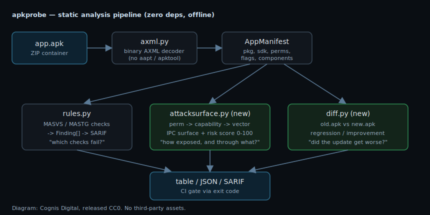

# Attack-surface profiling & version diffing

apkprobe started as a MASVS/MASTG checklist runner: point it at one APK, get a
list of failing checks. That answers *"which controls are missing?"* — but it
is not the first question a defender actually asks. The first two questions are:

1. **How exposed is this app overall, and through what?** (triage / prioritise)
2. **This is an *update* of an app we already vetted — did it get worse?**
   (supply-chain / update-time review)

`apkprobe 0.3` adds two subcommands that answer exactly those:
`profile` and `diff`. Both are pure-stdlib, deterministic, and run fully
offline — same as the rest of the tool.



*Diagram: Cognis Digital, released CC0. No third-party assets — generated SVG.*

---

## 1. `profile` — attack-surface & risk score

```bash
apkprobe profile app.apk            # human-readable
apkprobe profile app.apk --json     # machine-readable
```

A permission list is noise until you translate it into *intent*. The profiler
maps each requested permission to (a) the **capability** it grants and (b) a
documented **abuse vector**, then rolls everything into a single bounded
**risk score (0–100)** with a transparent breakdown.

### The capability knowledge base

`apkprobe/attacksurface.py` ships a hand-curated `PERMISSION_KB`. Every entry is
*documented Android platform behaviour* from the official permission reference
and the OWASP MASTG — **no fabricated CVEs, no speculative intel.** Each maps a
permission to a capability, a defensive vector tag, a numeric weight, and a
frank one-line note. Examples:

| Permission | Capability | Vector | Why a defender cares |
|---|---|---|---|
| `BIND_ACCESSIBILITY_SERVICE` | Accessibility service | `control:accessibility` | Screen-reading **+ input synthesis**. The single most-abused permission in Android banking trojans — it lets an app read everything on screen and tap on the user's behalf. |
| `BIND_DEVICE_ADMIN` | Device administration | `control:device-admin` | Lock/wipe/policy control. The mechanism behind Android ransomware and anti-uninstall persistence. |
| `REQUEST_INSTALL_PACKAGES` | Install other APKs | `persistence:install` | The dropper vector: a thin first-stage app that side-loads the real payload. |
| `SYSTEM_ALERT_WINDOW` | Draw over other apps | `deception:overlay` | Tapjacking and credential-overlay phishing — draw a fake login on top of a real bank app. |
| `RECEIVE_SMS` | Intercept incoming SMS | `exfiltration:messaging` | Steals OTP/2FA codes **before the user ever sees them**. |
| `SEND_SMS` | Send SMS | `fraud:billing` | Premium-SMS billing fraud and a silent text-based C2/exfil channel. |
| `MANAGE_EXTERNAL_STORAGE` | All-files access | `exfiltration:storage` | Scoped-storage bypass; broad read/write across the device filesystem. |

The full table is in the source and is unit-tested for well-formedness (every
entry has a capability, vector, note, and a weight in `1..10`).

### How the score is built (and why it's auditable)

The score is a sum of attributed components, then clamped to 100. The CLI and
JSON both print the **breakdown**, so a reviewer can see *exactly* where every
point came from — no opaque black-box number:

| Component | Contribution |
|---|---|
| Requested capabilities | sum of permission weights, **capped at 50** |
| Multi-vector capability | +6 if the app touches ≥4 distinct abuse vectors, +3 for exactly 3 (the `network` vector is excluded — INTERNET alone is not "diversity") |
| Unguarded exported components | 3 per component (providers +2 extra for data-leakage risk), **capped at 18** |
| `debuggable="true"` | +12 |
| `usesCleartextTraffic="true"` | +8 |
| `allowBackup="true"` | +4 |
| `minSdkVersion < 24` | +4 |

Grades: `A` (0–14) · `B` (15–29) · `C` (30–44) · `D` (45–59) · `E` (60–79) ·
`F` (80–100). `apkprobe profile` exits non-zero on an `E`/`F` grade, so it can
gate CI the same way `scan` does.

The **vector-diversity** signal is the analytically interesting one. A torch
app that asks for `CAMERA` is one capability in one vector. A "torch" app that
asks for `CAMERA` + `RECORD_AUDIO` + `READ_SMS` + `ACCESS_FINE_LOCATION` is
four *unrelated* surveillance/exfiltration vectors in one binary — a classic
over-permissioned-spyware shape. The bonus surfaces that pattern even when each
individual permission, in isolation, looks defensible.

### Example

```
$ apkprobe profile suspicious.apk
package: com.free.torch
risk score: 71/100  (grade E)
score breakdown:
  +34  requested-capabilities
  +6   multi-vector-capability
  +9   unguarded-exported-components
  +12  debuggable
  +4   adb-backup-allowed
  +6   low-min-sdk
abuse vectors:
  control:accessibility: Accessibility service
  exfiltration:messaging: Read SMS/MMS
  surveillance:audio: Microphone capture
  surveillance:location: Precise GPS location
capabilities (by weight):
  [10] Accessibility service — Screen-reading + input synthesis; banking-trojan staple.
  [ 9] Read SMS/MMS — Reads 2FA codes and private messages; high exfiltration value.
  [ 9] Microphone capture — Can record ambient audio; classic spyware capability.
  [ 8] Precise GPS location — Continuous fine location enables physical tracking.
exported IPC surface:
  service .CmdService [UNGUARDED] intent-filters=1
```

---

## 2. `diff` — update-time regression detection

```bash
apkprobe diff old.apk new.apk                       # report
apkprobe diff old.apk new.apk --json                # machine-readable
apkprobe diff old.apk new.apk --fail-on-regression  # CI update-gate
```

You vetted v1.4 and shipped it to your fleet. v1.5 arrives. Re-running a full
scan tells you the *state* of v1.5, but not the *change* — and the change is the
threat. A silent update that newly turns on `debuggable`, adds `READ_SMS`,
exports a previously-private content provider, rotates to a different signing
key, or embeds a fresh API key is the textbook shape of a **supply-chain
compromise** (build pipeline tampering, dependency takeover, or a malicious
maintainer). `diff` classifies every delta:

* **regression** — security got *worse* (this is what you gate on),
* **improvement** — security got *better*,
* **neutral** — a change that isn't clearly either (e.g. a *guarded* new export).

### What it compares

| Delta | Classified as | Weight | Threat rationale |
|---|---|---|---|
| Permission added | regression | permission's KB weight (2 if uncatalogued) | New capability the user already trusted the app, so no new consent prompt for *upgrades* of granted groups |
| Permission removed | improvement | — | Reduced surface |
| `debuggable` ON / OFF | regression / improvement | 12 | Debug builds should never reach production |
| `usesCleartextTraffic` ON | regression | 8 | Re-opens MITM exposure |
| `allowBackup` ON | regression | 4 | Re-opens `adb backup` data extraction |
| Network Security Config removed | regression | 5 | Drops pinning/trust policy |
| `minSdkVersion` lowered | regression | 4 | Re-inherits old-platform vulns |
| New **unguarded** exported component | regression | 3 (provider 5) | New IPC entry point with no permission guard |
| Exported component **lost** its guard | regression | 5 | Previously-protected entry point now open |
| `package` id changed | regression | 10 | Repackaging / identity takeover |
| Signing scheme removed / v2+ downgraded | regression | 8 / 6 | Key rotation or scheme downgrade — strong tamper signal |
| New embedded secret | regression | 9 | Fresh hard-coded credential shipped in the update |

`--fail-on-regression` makes the command exit non-zero whenever **any**
regression is present, so it drops into a CI step that vets every update before
it is allowed to roll out:

```yaml
- name: gate the app update
  run: apkprobe diff baseline.apk candidate.apk --fail-on-regression
```

### Example

```
$ apkprobe diff v1.4.apk v1.5.apk
old: com.acme.app
new: com.acme.app
verdict: REGRESSED  (risk delta +24)
regressions (3):
  [-12] flag.debuggable: android:debuggable turned ON
  [-9 ] permission.added: newly requests android.permission.READ_SMS (Read SMS/MMS)
  [-5 ] component.guard.removed: provider .DataProvider lost its permission guard
improvements (1):
  [ok ] sdk.min_raised: minSdkVersion raised 21 -> 26
```

The `risk delta` line is the two attack-surface scores subtracted, so you also
get a single signed number for the *net* movement.

---

## Defensive scope & honest limits

This is detection/analysis tooling for apps **you are authorized to assess** —
your own, a client's under engagement, or lab/CTF targets. With
`--scope` (scopeward) it refuses any package not on an authorized list. apkprobe
is **static and read-only**: it never modifies, repackages, or executes an APK,
and it does not attempt exploitation. It is an early-warning / triage instrument,
not a kill chain.

Frank about what these two features do **not** do:

* The profiler reasons over the **manifest** (permissions, flags, exported
  surface). It does not decompile DEX, so it cannot tell you whether a granted
  permission is *actually exercised* in code — only that it was requested. A low
  score is "smaller declared surface", not a clean bill of health.
* The diff is a **manifest + signing + resource-secret** diff. It will not catch
  a malicious change that lives entirely inside native code or DEX with no
  manifest footprint. Pair it with dynamic analysis and DEX review for the full
  picture.
* The score weights are a defensible heuristic, not a calibrated probability.
  Their value is **consistency** — the same input always yields the same
  attributed breakdown — which is what makes it useful for *relative* triage and
  for regression gating across versions.

Treat both as the fast first pass that tells a human reviewer *where to look*.
